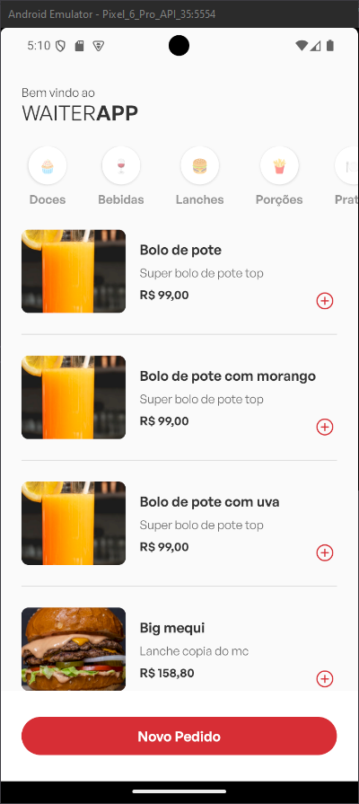
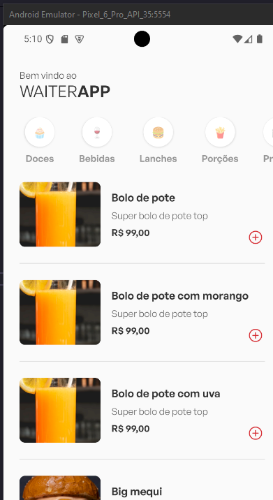
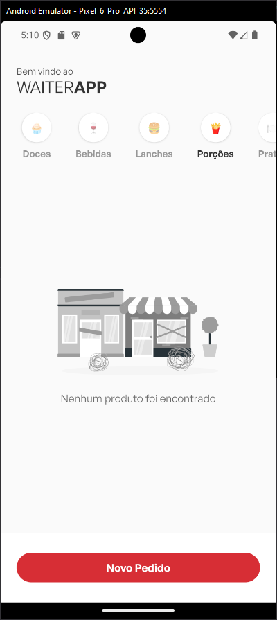
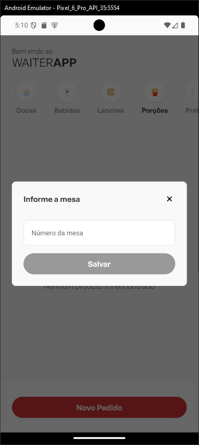
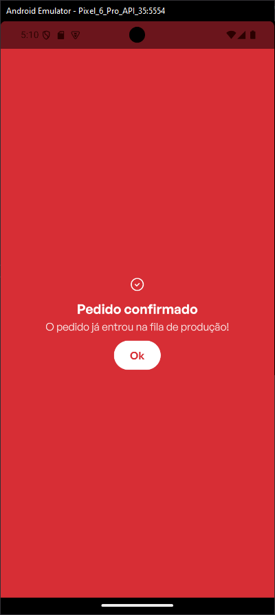

### References

- [Waiter app API](https://github.com/abnerpersio/waiter-backend)
- [Waiter app WEB client](https://github.com/abnerpersio/waiter-web)

### Screenshots


---

---

---

---

---



### Running the app

This apps runs with `expo` `52.0.11` and `react-native` `0.76.3`, set up your dev environment [with react-native docs](https://reactnative.dev/docs/0.76/set-up-your-environment)

1. Clone project

2. Create `.env` based on `.env.example` and configure project envs

3. Install deps with `yarn`

```
yarn install
```

4. Start mobile app server

```
yarn start
```
